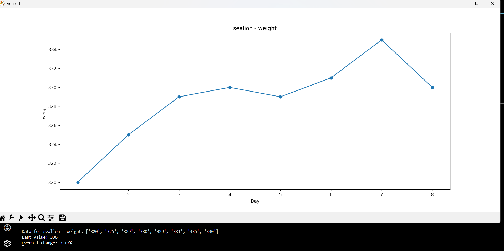

# Animal & plant status recorder v0.1

## What is this program?
This is a lightweight data tracking tool for recording and visualizing animal/plant health indicators. So far, the recorder support following indicators:
weight, blood pressure, body temperature (for animals) 
plant height, leaf count, harvestable biomass(for plants)

The program saves data locally(in .json file), generate trend graphs, calculates percentage over time. The program aims to explore how simple digital tools could support daily monitoring in field settings like garden and ocean parks.

The core structure and logic is completed by myself, while some debugging and refinement in certain parts is assisted by AI- a workflow i believe reflects the modern coding practices
## Features
1. Add animals or plants with preset health categories
2. Record daily measures of preset health indicators
3. View historical data and trends
4. graph generation

## Why this project?
I am interested in how technology can assist environmental and ecological work - even in a small way. This is my first self-built tool ever since i learn python. despite its simplicity now, i plan to upgrade its features to have more functions and more user-friendly in the future.

## Thoughts of future development
1. Implement better UI:
The recorder is now text - based, Its inconvenient to use. Would be better (and look cleaner) if user can operate it with buttons.

2. Support more customization: 
Right now the program only support preset health indicators, in future the program should support better customization. E.g. users can enter what category they want to record for this animal / plants, and for different animals and plants they can have different parameters.

3. More user-friendly:
Include a common-animal list and a common-plant list. If user enter an organism in these two list, they don't have to enter whether the organism is animal / plant. If they enter something else, the program can ask if they truly want to record this organism, if yes, they can record it. Else, they may have typo, therefore they can re-enter the organism.

4. Health Index:
The Health Index by default = 100. If animal / plant have signs that they become unhealthy, the health index will deduct score based on the extend of the sign.
e.g. For an adult California sea lion. According to research conducted by Heath and Perrin (Heath et.al, 2009)(https://www.sciencedirect.com/science/chapter/edited-volume/abs/pii/B9780123735539000468?via%3dihub), Adult california sea lion generally weight 350 kg and can reach up to 390 kg, so if what user record is out of the range by 10 %, health index will deduct 5 (just as example), and give a warning. the health index can also have a trend graph so user can better trace the animal / plant health

Health Index -- problems to be solved: 
Where can i find the data for all animals / plants (or at least most of the common animals and plants)? Vet standard? Scientific journal? is there an database?
'Normal' indicators can be different among the individuals. For example, the weight of an animal can depends on whether it is fed recently, its age, its sex, its genetic difference... how can i make the health index can accurately reflect the animal's health? 

Example graph:
 

# How to run
1. Please make sure you have installed Python3.x (https://www.python.org/downloads/)
2. Please make sure you have installed matplotlib so you can use the graph function. If you have not, please copy and paste the following command to your powershell:
    
    pip install matplotlib
3. If you are using Windows ,becuase of some features of the system, direct double-click the python file will let the program quit instantly. You may either:
   
   download the running_program as well, and double-click the running-program batch to run the program

   
   or

   
   copy and paste the following command to your cmd and run it :

   
   cd your\program\folder && python "animal-plants status recording program.py"

